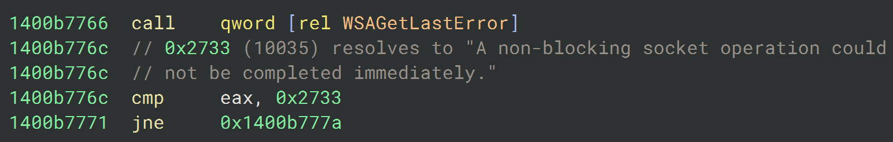

# Windows Error Code Resolver (Binary Ninja)

This plugin solves the problem of having to look up [Windows error codes](https://learn.microsoft.com/en-us/windows/win32/debug/system-error-codes) by adding an item to the context menu that allows you to resolve a code and perform one of the following actions:

- `Insert in Logging`
- `Insert as Comment`
- `Invoke as MsgBoxW`

The following example demonstrates the second option, in which the resolution is inserted into the disassembly view so that future revisits do not require another resolution:

<em>"Insert as Comment"</em>

The resolution process makes use of the [FormatMessageW](https://learn.microsoft.com/en-us/windows/win32/api/winbase/nf-winbase-formatmessagew) API, which means the plugin is small in size and can be used without an internet connection. One drawback is that the error code information is extracted from *your* system; this means that debugging PEs targeting other Windows builds may result in inaccurate resolutions.
